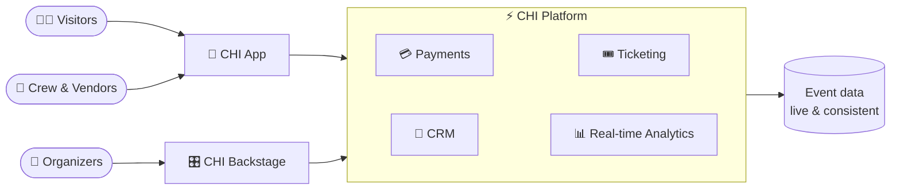

<div align="center">


# CHI

**The Operating System for Events**

*Cashless payments · Smart ticketing · Crew ops · Real-time analytics — one platform, every moment of the event.*

<br/>

[](https://chi.app)
[](https://chi.app/careers)
[](https://apps.apple.com/us/app/chi-app-new/id6759359337)
[](https://play.google.com/store/apps/details?id=app.chi.mobile)

</div>

---

## What is CHI?

CHI is the all-in-one operating system for festivals, venues, and live events. One platform runs the entire show — from the moment a ticket is sold to the second the last vendor gets settled.

No hardware lock-in. Any phone or tablet becomes a point of sale, a ticket scanner, or a crew terminal. Setup takes under 15 minutes, and the same stack scales from a 10-person pop-up to a 100,000+ attendee festival.

```
 ticket sold ──► gate scanned ──► wallet topped up ──► drinks poured ──► vendor settled
      └──────────────────── one platform, real-time, end to end ────────────────────┘
```

## The Ecosystem

| | Module | What it does |
|---|---|---|
| 🎛️ | **CHI Backstage** | The event command center — organizers configure, monitor, and control everything live. [backstage.chi.app](https://backstage.chi.app) |
| 📱 | **CHI App** | One mobile app for visitors *and* crew — wallet, tickets, POS, and scanning. iOS, Android & [PWA](https://web.chi.app) |
| 💳 | **CHI Payments** | Cashless transactions over QR and NFC, with live revenue tracking and settlement controls |
| 🎟️ | **CHI Tickets** | Smart ticketing with built-in fraud prevention and seamless gate flow |
| 🤝 | **CHI CRM** | Visitor profiles, segmentation, and engagement — know your crowd |
| 🎁 | **CHI Coupons & Kickback** | Smart rewards, referral programs, and VIP experiences that drive repeat visits |

Everything is white-label ready — organizers ship a fully branded app experience without writing a line of code.

## How it fits together



## Under the hood

Built by engineers who like their systems the way they like their festivals: high-throughput, fault-tolerant, and still standing at 4 AM.


- **Event-driven core** — payments, ticketing, and analytics react to the same real-time stream
- **Offline-tolerant edge** — the show goes on when festival Wi-Fi doesn't
- **Full observability** — metrics, logs, and traces on every transaction
- **Ship fast, ship safe** — automated release pipelines with staged promotion from test → staging → production

> Our product source lives in private repositories. Want to see the inside? [There's a door for that. →](https://chi.app/careers)

## Join the crew 🚀

We're a Rotterdam-based team building the future of event technology, and we're hiring.

If distributed payments at festival scale, real-time systems, or mobile products used by six-figure crowds sound like your kind of party:

<div align="center">

### **[→ Open roles at chi.app/careers ←](https://chi.app/careers)**

</div>

## Find us

[Website](https://chi.app) · [Support](https://chi.app/support) · [LinkedIn](https://www.linkedin.com/company/eventchi) · [X](https://x.com/eventchi) · [Instagram](https://instagram.com/eventchi) · [YouTube](https://youtube.com/@eventchi) · [TikTok](https://tiktok.com/@eventchi)

---

<div align="center">
<sub>© EventCHI B.V. · Westplein 12, Rotterdam, The Netherlands · <strong>The future of event technology, today.</strong></sub>
</div>
