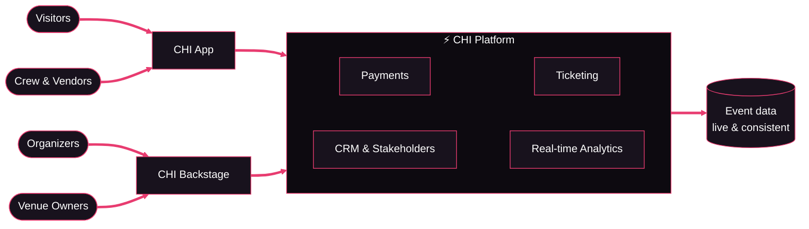

# CHI

**The Operating System for Events**

*The future of event technology, today.*

 

---

## What is CHI?

CHI is a unified operating system for events that bridges physical interactions with digital systems. It replaces fragmented event infrastructure — outdated ticketing, disconnected payment terminals, spreadsheet crew ops — with one connected platform for tickets, payments, visitor engagement, crew operations, stakeholders, VIP, coupons, and analytics.

No hardware lock-in. Any phone or tablet becomes a point of sale, a ticket scanner, or a crew terminal. Setup takes under 15 minutes, and the same stack scales from a 10-person pop-up to a 100,000+ attendee festival. And it's fully **white-label**: the entire experience ships under the organizer's own brand — app, tickets, payments, and all.

<picture>
  <source media="(prefers-color-scheme: dark)" srcset="https://raw.githubusercontent.com/CHI-Ecosystem/.github/main/profile/assets/journey-dark.svg" />
  
</picture>

## Why we build it

> **Events shape the world.** Many of the most significant shifts in society and innovation trace back to a single moment — an event. Woodstock shaped generations. Burning Man's ethos shaped Silicon Valley. Events don't just reflect culture — they create it. Yet the technology behind them has barely evolved: fragmented tools, outdated ticketing, and zero intelligence.
>
> **That's why we built CHI.** We combine artificial intelligence and blockchain to orchestrate perfect experiences — solving the trilemma of security, speed, and scale. [Read our story →](https://chi.app/en/about)

-  **AI-Native Intelligence** — AI across every internal and external process, from predictive crowd management to personalized attendee experiences
-  **Blockchain Security** — fraud-proof NFT ticketing and verifiable proof of attendance, cryptographically secured and instantly verifiable
-  **Seamless Ecosystem** — organizers, partners, and visitors on one platform. No data silos, just pure flow

## The Ecosystem

Modular, plug-and-play solutions for every aspect of your event:

| | Module | What it does |
|---|---|---|
|  | **[CHI Tickets](https://chi.app/en/chi-tickets)** | Smart, secure event tickets — marketplace, transfers, digital twins, referrals, and analytics |
|  | **[CHI Payments](https://chi.app/en/chi-payments)** | Cashless payments over QR, NFC & Tap to Pay — orchestrated across multiple PSPs, with digital token wallets, top-ups, refunds, live revenue tracking, and settlement controls |
|  | **CHI App** | One mobile experience for visitors *and* crew — tickets, wallet, QR/NFC, and event info. [iOS](https://apps.apple.com/us/app/chi-app-new/id6759359337) · [Android](https://play.google.com/store/apps/details?id=app.chi.mobile) · [PWA](https://web.chi.app) |
|  | **[CHI Backstage](https://backstage.chi.app)** | The event command center — event creation, crew management, revenue analytics, access control |
|  | **[CHI CRM](https://chi.app/en/chi-crm)** | 360° visitor insights — attendee profiles, segmentation, and engagement tools |
|  | **[CHI Stakeholders](https://chi.app/en/chi-stakeholders)** | Vendor, sponsor & partner portal with settlement management |
|  | **[CHI VIP](https://chi.app/en/chi-vip)** | Premium tables, guest management, credits, and concierge-style event flows |
|  | **[CHI Coupons](https://chi.app/en/chi-coupons)** | Programmable coupons — promo codes, vouchers, discounts, and redemption analytics |
|  | **[CHI Kickback](https://chi.app/en/chi-kickback)** | Earn your ticket back — referral and rewards tooling for attendees and promoters |

Everything is white-label ready — organizers ship a fully branded app experience without writing a line of code.

## Built for developers — and their AI agents

CHI isn't just an app, it's a platform. The same core that powers our own 100+ AI agents is what you integrate with:

| | Surface | What you get |
|---|---|---|
|  | **REST API** | The full platform — tickets, payments, CRM, analytics — behind one API gateway |
|  | **TypeScript SDKs** | Typed clients generated straight from the API — what our own web & mobile apps run on |
|  | **CLI** | Script and automate event operations from your terminal or CI |
|  | **MCP server** | Plug CHI into Claude, agents, and any MCP-compatible tooling — the event OS as a toolset |
|  | **llms.txt** | Machine-readable public context at [/llms.txt](https://chi.app/llms.txt) & [/llms-full.txt](https://chi.app/llms-full.txt) — AI-agent friendly by design |

Start at the [developer overview →](https://chi.app/en/developers)

## How it fits together

## The autonomous company

CHI is the autonomous event-technology company: a small, highly skilled human team directing **100+ AI agents** that are embedded in our workflow — from code to ops. Every team member works alongside them to move faster and build smarter.

No rigid roles, no job titles — everyone brings their expertise across product, engineering, design, and strategy. We believe lean teams with the right leverage can outpace companies ten times their size, and our work touches millions of event-goers competing with — and beating — companies 10× our size.

Born in **Rotterdam**, where Dutch event culture meets a world-class tech sector. Our innovation & AI lab lives in **Bali**, the epicenter of Asia's live-events scene.

## Under the hood

Built by engineers (human *and* AI) who like their systems the way they like their festivals: high-throughput, fault-tolerant, and still standing at 4 AM. We build on open source wherever possible — battle-tested infrastructure over black boxes.

**Languages & apps**

**Platform & data**

**Infra & observability**

- **Event-driven core** — payments, ticketing, and analytics react to the same real-time stream
- **AI-native pipeline** — RAG agents for product creation, AI-simulated event testing, agents embedded from code to ops
- **AI workforce** — 100+ autonomous agents run the backlog in continuous loops: pick up an issue, spin up an isolated workspace, ship, repeat — coordinating through a shared brain of docs, decisions, and learnings
- **Offline-tolerant ticketing** — gates keep scanning when festival Wi-Fi doesn't
- **Full observability** — metrics, logs, and traces on every transaction
- **Ship fast, ship safe** — automated release pipelines with staged promotion from test → staging → production

> Our product source lives in private repositories. Want to see the inside? [There's a door for that. →](https://chi.app/en/careers)

## Join the crew 

We treat AI agents as full members of the crew — now we're hiring more humans to direct them. Small team, outsized impact, no job titles, real ownership. Engineering, AI, product, and event-success roles across our hubs.

 Rotterdam · Bali · remote-friendly&ensp;·&ensp; [work@chi.app](mailto:work@chi.app)

### **[→ Open roles at chi.app/en/careers ←](https://chi.app/en/careers)**

## Org pulse 

<picture>
  <source media="(prefers-color-scheme: dark)" srcset="https://raw.githubusercontent.com/CHI-Ecosystem/.github/metrics/github-metrics-dark.svg" />
  
</picture>

<picture>
  <source media="(prefers-color-scheme: dark)" srcset="https://raw.githubusercontent.com/CHI-Ecosystem/.github/metrics/github-activity-dark.svg" />
  
</picture>

## Find us

&emsp;&emsp;&emsp;&emsp;&emsp;&emsp;&emsp;&emsp;

---

© EventCHI B.V. · Rotterdam HQ, Westplein 12 · Bali AI Lab, Ubud · <strong>The future of event technology, today.</strong>

